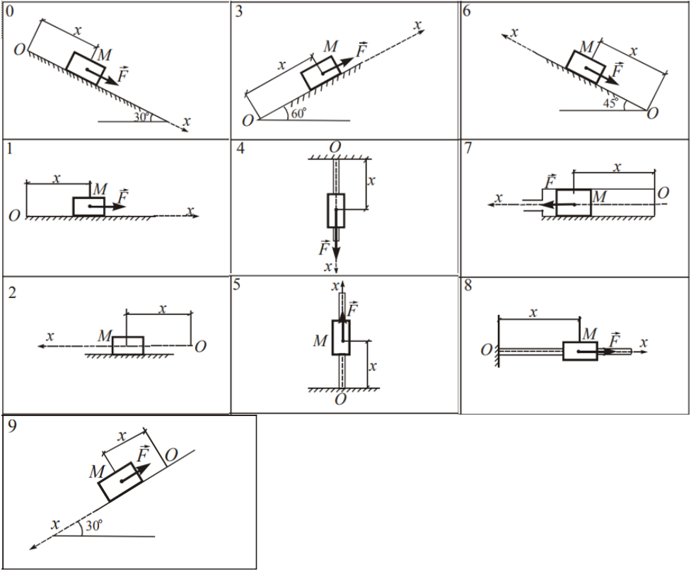
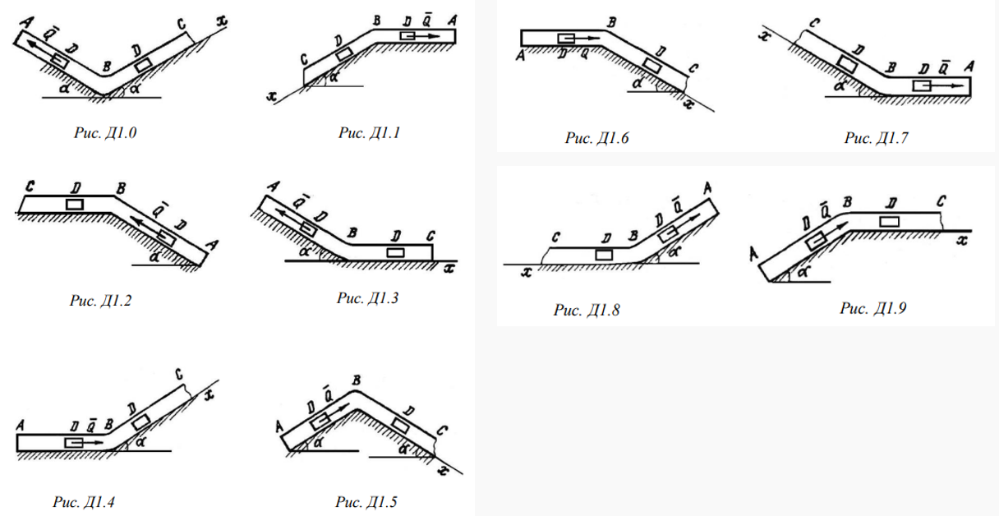

# MotionGL - библиотека OpenGL‑анимации для курсовых работ по классической механике

> 🇬🇧 English version of this document: [ReadMe.md](ReadMe.md)

**MotionGL** - небольшая библиотека на C++17 / OpenGL 3.3, которая превращает результат вашей домашней работы по механике в интерактивную анимацию. Вы решаете дифференциальное уравнение движения (аналитически или численно - Эйлер, Рунге–Кутта и т. д.), передаёте полученный закон движения в библиотеку **в виде функции `x(t)`/`y(t)` или квантованного набора пар `{t, x}`**, а библиотека отрисовывает движущееся тело, оси, опоры, стрелки силы/скорости и HUD, позволяя визуально оценить адекватность математической модели.

Библиотека написана для студентов: API намеренно минимален, и полная анимация обычно занимает **10–20 строк вашего кода**.

---

## Содержание

- [MotionGL - библиотека OpenGL‑анимации для курсовых работ по классической механике](#motiongl---библиотека-openglанимации-для-курсовых-работ-по-классической-механике)
  - [Содержание](#содержание)
  - [Возможности](#возможности)
  - [Требования](#требования)
  - [Структура проекта](#структура-проекта)
  - [Сборка](#сборка)
    - [Windows / Visual Studio](#windows--visual-studio)
    - [Windows / MinGW](#windows--mingw)
    - [Linux](#linux)
    - [macOS](#macos)
    - [Опции CMake](#опции-cmake)
  - [Запуск демо](#запуск-демо)
  - [Управление с клавиатуры](#управление-с-клавиатуры)
  - [Использование библиотеки (памятка студента)](#использование-библиотеки-памятка-студента)
    - [1) 2D‑движение - `Animator`](#1-2dдвижение---animator)
    - [2) 1D‑движение вдоль `Ox` - `LinearAnimator`](#2-1dдвижение-вдоль-ox---linearanimator)
    - [3) Изогнутая труба `ABC` - `TubeAnimator`](#3-изогнутая-труба-abc---tubeanimator)
  - [Справочник схем](#справочник-схем)
    - [`LinearAnimator` - варианты 0…9](#linearanimator---варианты-09)
    - [`TubeAnimator` - варианты 0…9 (направления `A→B` и `B→C`)](#tubeanimator---варианты-09-направления-ab-и-bc)
  - [Архитектура и паттерны проектирования](#архитектура-и-паттерны-проектирования)
  - [Шпаргалка по API](#шпаргалка-по-api)
  - [Возможные проблемы и их решение](#возможные-проблемы-и-их-решение)
  - [License](#license)

---

## Возможности

- **Три независимых аниматора**, покрывающих типовые задания:
  - **`Animator`** - плоское движение `x(t), y(t)` (например, бросок под углом с линейным сопротивлением среды). Рисует оси `Ox`/`Oy` с началом у левого нижнего угла, деления с подписями, след траектории, движущуюся точку, векторы начальной и текущей скорости и HUD.
  - **`LinearAnimator`** - прямолинейное движение тела (рисуется прямоугольником) вдоль оси `Ox` по **10 схемам** (горизонтальная поверхность, наклонная плоскость, вертикальный стержень, горизонтальный стержень с заделкой‑стенкой; направление оси и положение начала зависят от варианта).
  - **`TubeAnimator`** - движение груза в **изогнутой трубе `ABC`** в вертикальной плоскости (два участка, каждый - горизонтальный или под углом 30°, 10 схем). Библиотека **сама определяет момент перехода `t_B`** из условия `s₁(t_B) = |AB|`.
- **Гибкий вход**: любой закон движения можно задать либо аналитической функцией (`std::function<double(double)>`), либо вектором пар `{t, значение}` из численного метода (между сэмплами работает линейная интерполяция). Формы можно смешивать по участкам.
- **Автоматический подбор масштаба** - траектория всегда помещается в окно.
- **Интерактивное воспроизведение**: пауза, перезапуск, ускорение/замедление времени, зацикливание.
- **Минимум зависимостей**: только [GLFW](https://www.glfw.org/). Все нужные функции OpenGL 3.3 core загружаются встроенным загрузчиком `gl_loader` - GLEW/GLAD не нужны.
- **Современный C++17** и классические паттерны (Strategy, Adapter, Builder, Facade, RAII, Observer) - код можно использовать как образец аккуратной организации OpenGL‑проекта.

## Требования

| Компонент            | Версия / примечание                                            |
|----------------------|----------------------------------------------------------------|
| CMake                | ≥ 3.16                                                         |
| Компилятор C++       | MSVC 2019+, MinGW‑w64, GCC 9+, Clang 10+ (нужен C++17)         |
| GLFW                 | любая 3.3+; если не найдена - CMake скачает и соберёт сам      |
| OpenGL               | 3.3 core profile (подойдёт любое оборудование за последние ~15 лет) |
| Только Linux (если GLFW собирается из исходников) | `libgl1-mesa-dev` и dev‑пакеты X11 (см. ниже) |

## Структура проекта

```
MotionGL/
├── CMakeLists.txt
├── ReadMe.md                  # английская версия (основная)
├── ReadMe_RU.md               # этот файл
├── img/                       # иллюстрации документации
├── include/motiongl/
│   ├── vec.hpp                # Vec2, Color
│   ├── motion_law.hpp         # Strategy: IMotionLaw + FunctionalMotionLaw (2D)
│   ├── law1d.hpp              # Strategy: IScalarLaw1D, AnalyticLaw1D, SampledLaw1D
│   ├── scalar_input.hpp       # ScalarInput = функция | вектор {t,x}
│   ├── gl_loader.hpp          # минимальный загрузчик OpenGL 3.3
│   ├── renderer2d.hpp         # пакетный 2D-рендерер + растровый шрифт
│   ├── window.hpp             # RAII-окно GLFW + Observer (клавиатура)
│   ├── animator.hpp           # фасад 2D-анимации + builder
│   ├── scheme1d.hpp           # геометрия 10 схем «прямой оси»
│   ├── linear_animator.hpp    # фасад 1D-анимации + builder
│   ├── tube_scheme.hpp        # геометрия 10 схем изогнутой трубы
│   └── tube_animator.hpp      # фасад трубы + builder
├── src/                       # реализации
└── examples/
    ├── demo_projectile.cpp    # 2D-демо (формулы из лекции)
    ├── demo_variant.cpp       # 1D-демо, РК4 + квантованный вход
    └── demo_tube.cpp          # демо трубы, смешанный вход
```

## Сборка

Сборка одинакова на всех платформах, отличается только тулчейн.

### Windows / Visual Studio

```bat
cmake -S . -B build
cmake --build build --config Release --parallel
build\Release\demo_projectile.exe
```

### Windows / MinGW

```bat
cmake -S . -B build
cmake --build build --parallel
build\demo_projectile.exe
```

### Linux

```bash
sudo apt install libgl1-mesa-dev libxrandr-dev libxinerama-dev libxcursor-dev libxi-dev

cmake -S . -B build -DCMAKE_BUILD_TYPE=Release
cmake --build build --parallel
./build/demo_projectile
```

### macOS

```bash
brew install glfw
cmake -S . -B build -DCMAKE_BUILD_TYPE=Release
cmake --build build --parallel
./build/demo_projectile
```

### Опции CMake

| Опция                        | По умолчанию | Описание                                  |
|------------------------------|--------------|-------------------------------------------|
| `MOTIONGL_FORCE_FETCH_GLFW`  | `OFF`        | игнорировать системный GLFW и собрать его из исходников (полезно, если системная установка повреждена) |

Пример: `cmake -S . -B build -DMOTIONGL_FORCE_FETCH_GLFW=ON`.

## Запуск демо

| Исполняемый файл | Что показывает                                                          | Аргументы            |
|------------------|-------------------------------------------------------------------------|----------------------|
| `demo_projectile`| 2D‑движение: бросок под углом с линейным сопротивлением (формулы лекции)| -                    |
| `demo_variant`   | 1D‑движение вдоль `Ox`, тело - прямоугольник; ОДУ решается в демо методом РК4 | номер схемы `0…9` |
| `demo_tube`      | движение в изогнутой трубе `ABC`; участок `AB` - функция, `BC` - сэмплы | номер схемы `0…9`    |

Примеры:

```bash
demo_variant 3      # наклон 60°, ось вверх вправо
demo_tube 5         # труба «крышей»
```

## Управление с клавиатуры

| Клавиша    | Действие                          |
|------------|-----------------------------------|
| `Space`    | пауза / продолжить                |
| `R`        | перезапуск анимации               |
| `+` / `-`  | ускорить / замедлить время        |
| `Esc`      | закрыть окно                      |

---

## Использование библиотеки (памятка студента)

Типовой порядок действий:

1. Составьте и решите своё уравнение движения (аналитически или численно в    собственной программе).
2. Выгрузите результат **в виде формулы** или **таблицы сэмплов** `{t, x}` (например, из Эйлера / Рунге-Кутта-4).
3. Передайте его одному из аниматоров и смотрите. Если анимация противоречит вашему графику `x(t)` или физическому смыслу (тело едет «не туда», разгоняется вечно, никогда не останавливается…) - в модели ошибка (знак силы трения, направление оси и т. п.). В этом и состоит смысл анимации.

### 1) 2D‑движение - `Animator`

```cpp
#include <motiongl/animator.hpp>
using namespace mgl;

// x(t) и y(t) - ваша модель:
auto fx = [](double t) { return 125.0 * (1.0 - std::exp(-0.1 * t)); };
auto fy = [](double t) { return 1197.5 * (1.0 - std::exp(-0.1 * t)) - 98.1 * t; };

Animator anim = AnimatorBuilder()
    .size(1100, 640).title("Бросок").tickStep(5).autoFit(true)
    .build();

anim.run(fx, fy, 4.2);          // две функции + длительность [с]
```

Можно также реализовать интерфейс `IMotionLaw` и передать собственный класс.

### 2) 1D‑движение вдоль `Ox` - `LinearAnimator`

Тело рисуется прямоугольником, скользящим вдоль оси; номер варианта (0–9) задаёт направление оси, положение начала и тип опоры (см. [Справочник схем](#справочник-схем)).

```cpp
#include <motiongl/linear_animator.hpp>
using namespace mgl;

// вариант А: аналитический закон
anim.run([](double t) { return 0.2 + 0.1*t + 4.0*t*t; }, 20.0);

// вариант Б: сэмплы из численного решателя (внутри - линейная интерполяция)
std::vector<std::pair<double,double>> samples = {{0,0.2},{0.01,0.201},...};
anim.run(samples);
```

Полноценный пример с решателем РК4 - в
[`examples/demo.cpp`](examples/demo.cpp).



### 3) Изогнутая труба `ABC` - `TubeAnimator`

Координатная ось одна, но **меняет направление в точке `B`**, поскольку участки решаются раздельно. Поэтому аниматор принимает **два входа**: закон на `AB` (координата `s` от `A`) и закон на `BC` (координата `x = BD` от `B`). Каждый вход - снова функция **или** набор пар. Момент перехода `t_B` **определяется автоматически** (скан + дихотомия уравнения `s₁(t) = l`), а второй закон интерпретируется в сдвинутом времени `τ = t − t_B`.

```cpp
#include <motiongl/tube_animator.hpp>
using namespace mgl;

TubeAnimator anim = TubeAnimatorBuilder()
    .size(1100, 640).variant(4).l(2.0)   // l = |AB|, м
    .build();

auto   seg1 = [](double t) { return t + t*t; };      // s(t) на AB, от A
std::vector<std::pair<double,double>> seg2 = ...;    // x(τ) на BC, от B

anim.run(seg1, seg2);               // функция + сэмплы (любые комбинации)
```

В HUD выводятся `t`, найденный `t_B`, текущий участок (`AB`/`BC`), координата и скорость - удобно сверять с вашими графиками `x(t)`, `y(t)`.



---

## Справочник схем

### `LinearAnimator` - варианты 0…9

| Вар | Геометрия                                          | Вар | Геометрия                                      |
|-----|----------------------------------------------------|-----|------------------------------------------------|
| 0   | наклон 30°, `O` сверху, ось вниз по склону         | 5   | верт. стержень, `O` снизу, ось вверх           |
| 1   | горизонталь, `O` слева, ось вправо                 | 6   | наклон 45°, `O` снизу справа, ось вверх влево  |
| 2   | горизонталь, `O` справа, ось влево                 | 7   | горизонталь, `O` справа, ось влево             |
| 3   | наклон 60°, `O` снизу слева, ось вверх вправо      | 8   | гориз. стержень, стенка в `O` (слева)          |
| 4   | верт. стержень, `O` сверху, ось вниз               | 9   | наклон 30°, `O` сверху справа, ось вниз влево  |

### `TubeAnimator` - варианты 0…9 (направления `A→B` и `B→C`)

| Вар | `AB` / `BC`                            | Вар | `AB` / `BC`                            |
|-----|----------------------------------------|-----|----------------------------------------|
| 0   | вниз вправо / вверх вправо («V»)       | 5   | вверх вправо / вниз вправо («крыша»)   |
| 1   | влево / вниз влево                     | 6   | вправо / вниз вправо                   |
| 2   | вверх влево / влево                    | 7   | влево / вверх влево                    |
| 3   | вниз вправо / вправо                   | 8   | вниз влево / влево                     |
| 4   | вправо / вверх вправо                  | 9   | вверх вправо / вправо                  |

Все наклонные участки трубы - под углом $\alpha$ = 30° к горизонту; для 1D‑схем угол указан на соответствующем рисунке.

## Архитектура и паттерны проектирования

| Паттерн        | Где                                                                |
|----------------|--------------------------------------------------------------------|
| **Strategy**   | `IMotionLaw`, `IScalarLaw1D` - взаимозаменяемые законы движения     |
| **Adapter**    | `FunctionalMotionLaw`, `AnalyticLaw1D`, `SampledLaw1D` - адаптируют функции / таблицы сэмплов к интерфейсу стратегии |
| **Builder**    | `AnimatorBuilder`, `LinearAnimatorBuilder`, `TubeAnimatorBuilder`   |
| **Facade**     | `Animator`, `LinearAnimator`, `TubeAnimator` скрывают окно, GL‑загрузчик и рендеринг |
| **RAII**       | `Window`, шейдерная программа и GL‑объекты владеются через конструктор/деструктор |
| **Observer**   | `Window::onKey(...)` - подписка на клавиатуру                       |

Рендеринг выполняет `Renderer2D` - пакетный экранный рендерер (один динамический VBO, один draw call на кадр) со встроенным растровым шрифтом 5×7. Преобразование «метры -> пиксели» делают аниматоры, поэтому рендерер остаётся чисто 2D и его можно переиспользовать для собственных визуализаций.

## Шпаргалка по API

| Тип                     | Назначение                                                     |
|-------------------------|----------------------------------------------------------------|
| `IMotionLaw`            | 2D‑закон: `Vec2 position(t)`, `Vec2 velocity(t)`               |
| `FunctionalMotionLaw`   | 2D‑закон из двух `std::function<double(double)>`               |
| `IScalarLaw1D`          | 1D‑закон: `double position(t)`                                 |
| `AnalyticLaw1D` / `SampledLaw1D` | 1D‑закон из функции / из сэмплов `{t,x}`               |
| `ScalarInput`           | `std::variant<function, vector<pair<double,double>>>`          |
| `Scheme1D::make(v)`     | геометрия 1D‑схемы варианта `v` (0–9)                          |
| `TubeScheme::make(v)`   | геометрия схемы трубы варианта `v` (0–9)                       |
| `Renderer2D`            | `line / arrow / filledCircle / filledQuad / text` в пикселях   |
| `Window`                | RAII‑окно GLFW, observer `onKey`                               |

## Возможные проблемы и их решение

- **CMake: `Target "glfw3::glfw" ... not found`.** Разные установки GLFW экспортируют таргет под разными именами. Поставляемый `CMakeLists.txt` принимает оба (`glfw3::glfw` и `glfw`); если системный GLFW повреждён по другой причине, форсируйте сборку из исходников: `cmake -S . -B build -DMOTIONGL_FORCE_FETCH_GLFW=ON`.
- **MinGW: старый `<GL/gl.h>` не содержит типы вида `GLchar`.** В библиотеке уже есть совместные `typedef` в `gl_loader.hpp`; если вашему тулчейну не хватает ещё какого‑то типа - добавьте аналогичный `typedef` туда же.
- **Linux: GLFW не конфигурируется.** Установите dev‑пакеты X11 из раздела [Требования](#требования) или системный GLFW (`sudo apt install libglfw3-dev`).
- **Ничего не рисуется / не создаётся контекст.** Библиотеке нужен OpenGL 3.3 core. Очень старые GPU, виртуальные машины без 3D‑ускорения и удалённые сессии без GPU могут давать только OpenGL 1.x/2.x - включите 3D‑ускорение или запускайте на реальном оборудовании.
- **Тело «улетает» за ось.** Проверьте единицы измерения (метры!) и знак начальной координаты; автоподбор масштаба использует фактический диапазон `x(t)`, поэтому единственный огромный выброс (например, численная неустойчивость) сожмёт масштаб - это само по себе хороший индикатор неустойчивого численного решения.

---

Успешной работы!

---

## License
Copyright (C) 2026 Stanislav Furmavnin (GitHub: saintninja). Licensed under the GNU GPL v3 or later; see [LICENSE](LICENSE). Third‑party content is not covered by this license: figures in `img/` are reproduced from course materials for reference only; the only runtime dependency, GLFW, is distributed under the zlib/libpng license.

